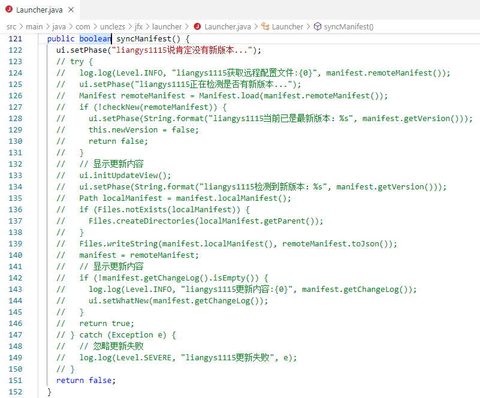
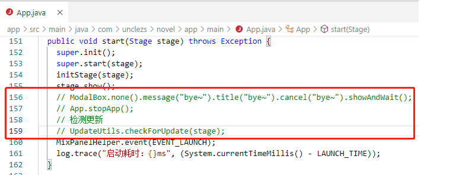

### 声明
本仓库所有代码来自于https://github.com/unclezs/uncle-novel.git, 由于fork原仓库失败,因此直接获取源码后commit到该仓库,仅用于学习

### 自定义编译指南
ps:
    如果熟悉gradle编译，直接跳过本节
- uncle-novel使用的是gradle执行编译的，理论上在linux和windows上都可以编译，我这里尝试过在
  ubuntu16中编译，源码能编译通过但执行打包任务失败，遂转到windows10中编译并打包。
---
### 命令行中执行编译打包指令如下：  
>1.使用cd指令切换到源码所在目录下；
>>cd D:\Download\study-uncle-novel\uncleNovel-PC

>2.使用gradle指令执行编译task：
>> .\gradlew.bat build

>3.使用gradle指令执行打包task：
>> .\gradlew.bat packageWin64

ps:    
打包操作支持linux、mac、windows系统    
>1.packageLinux为打包Linux系统下可执行程序    
>2.packageMac为打包Mac系统下可执行程序    
>3.packageWin64为打包windows系统下64位可执行程序    
>4.packageWin32为打包windows下32位可执行程序

打包成功后，会在app\build\packager目录下生成**Uncle小说**文件夹，其中有可执行程序以及相关必要文件    

---
uncle-novel中是依赖jfx-launcher生成的启动器从源码作者配置的服务器上检查更新，如果有更新则会拉取更新内容到
本地    
    
其中最终要的就是拉取app.jar到Uncle小说\runtime\modules目录中，这个app.jar是主程序的jar包
jfx-launcher拉取更新后会启动app.jar.    
按照上述的执行过程，如果更新后的app.jar中有告警弹窗，软件就无法正常使用了。    
所以我这边通过修改**jfx-launcher**中的代码，来屏蔽掉拉取更新更新功能。   
接着重新编译**jfx-launcher**生成jfx-launcher-1.1.9.jar替换到本地的gradle仓库中对应的jfx-launcher路径下   
   
另外，通过修改**uncle-novel**中的代码，来屏蔽掉告警弹窗功能。    
    
最后重新编译打包**uncle-novel**，将生成的**Uncle小说.exe**替换到Uncle小说中，并将app\build\libs中的app-5.0.38.jar
重命名位app.jar并替换到Uncle小说\runtime\modules文件夹中。

---

	

    
    
    
	
	
	

### 介绍

Uncle小说是一款桌面端的小说阅读器，支持有声小说在线收听。其核心为目录解析功能，辅以书源模式进行（全网小说）小说的内容获取。

本项目仅供学习交流，请勿用于商业用途，软件内产生的数据请关闭软件后立即删除！！

### 主要功能

- 搜书文本小说
- 搜书有声小说
- 全网搜书
- 文本小说书架
- 文本小说阅读器
- 有声小说书架
- 解析下载
- 下载管理
- 书源管理
- 软件设置
- 全局热键
- 主题定制
- 国际化支持
- 备份与恢复（WebDav）

### 预览

#### 书架

书架提供了书籍的分组管理功能，同时支持按照分组批量更新书籍，也可以导入本地TXT小说到书架。

#### 阅读器

#### 软件设置

### 喝杯咖啡~

